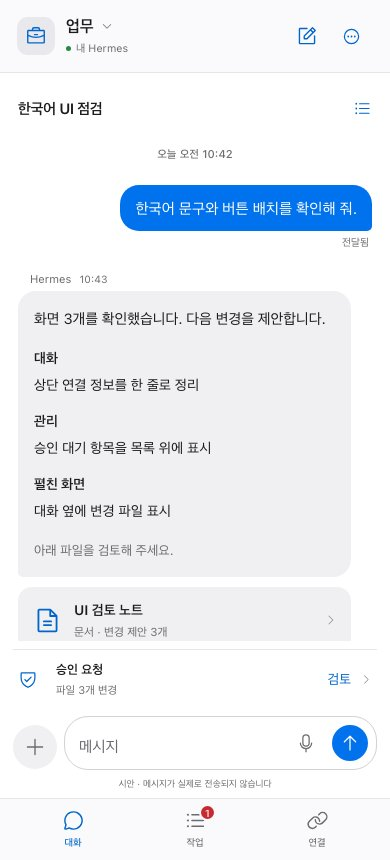
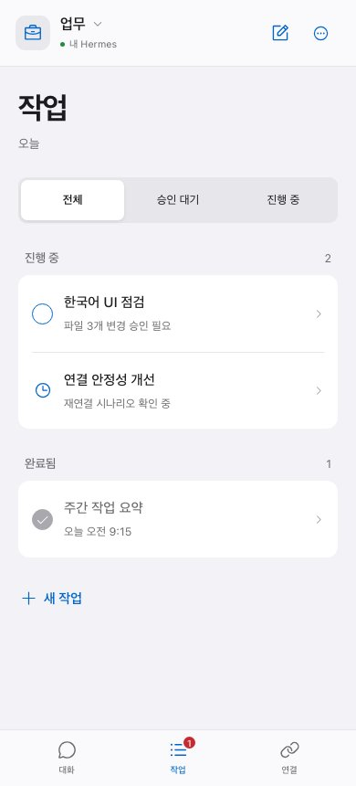
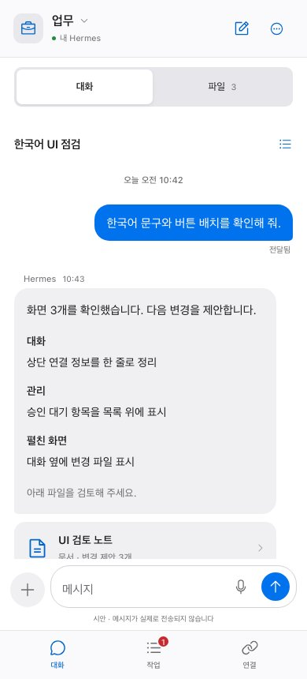
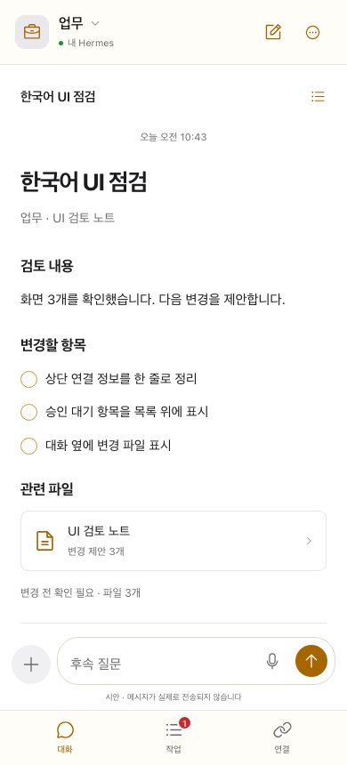
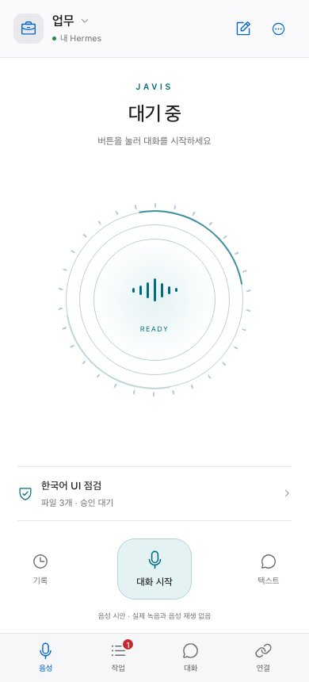
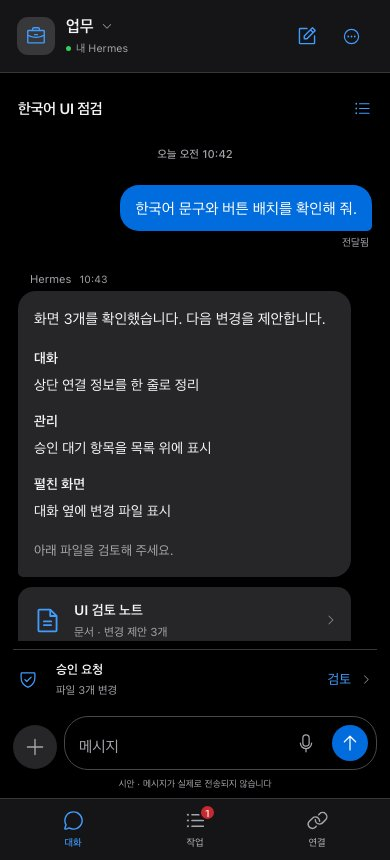
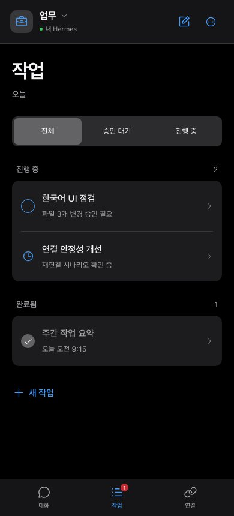
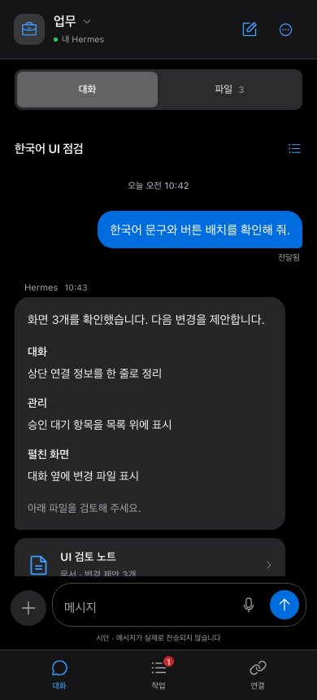
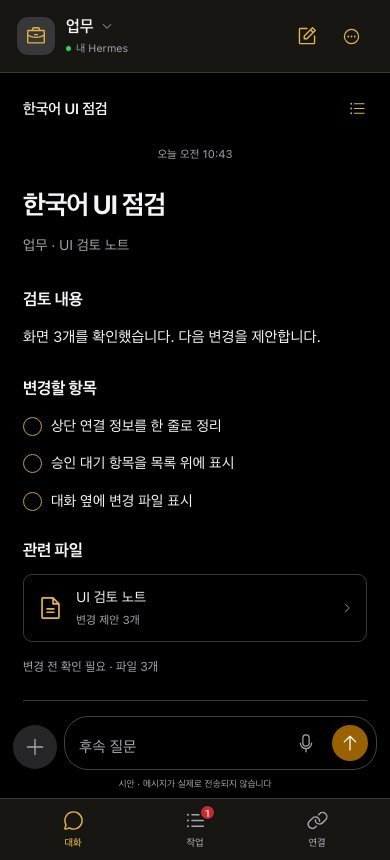
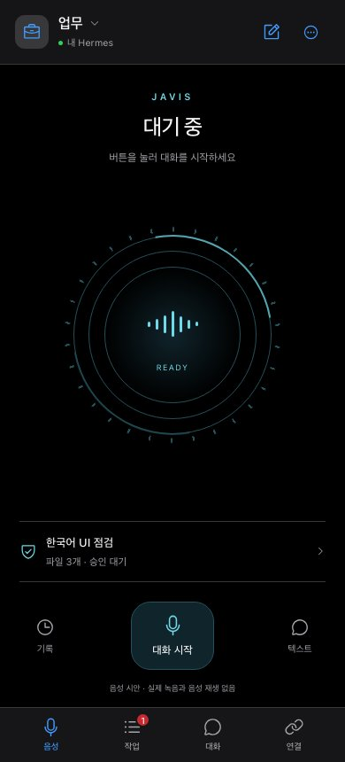

# Hermes-Connect UI study

Five interactive Korean design proposals for the Android companion. Revision 3
combines light/dark appearance, separate profile contexts, official Phosphor
icons, and a Javis-style voice assistant. Conversation, task, file, and note
screens use system typography, grouped lists, and thin separators. Voice has a
circular activity signal and a profile-specific transcript.

Open the gallery through a local static HTTP server:

```sh
python3 -m http.server 4321 --bind 127.0.0.1 --directory design/uiux-preview
```

The preview runs as static files with no API calls, model calls, microphone
capture, file upload, or live harness connection. Sample approval decisions only update
browser memory. The design selection is stored in this browser's local storage.
The Apple-style revision uses a separate selection key so an earlier choice is not presented
as approval of the redesign. Direct `app.html?concept=studio` links use the
available viewport width.

## Design directions

| Direction | Reference structure | Main behavior | Tradeoff |
| --- | --- | --- | --- |
| Messages (`focus`) | Messages | Conversation, attachments, compact approval row | Task overview requires a tab change |
| Task list (`mission`) | Reminders | Status filters, pending work, completed rows | Conversation requires selecting a task |
| Files (`studio`) | Files and split views | Conversation alongside changed files, notes, and activity | Narrow screens switch panels |
| Notes (`paper`) | Notes | Document headings, checklist, related files | Reading results takes priority over live operations |
| Javis voice (`pulse`) | Conversational assistant | Voice states, circular signal, profile-scoped transcript | Simulated conversation; approvals remain explicit |

Messages plus Files is the proposed narrow/wide combination. This is a design
proposal, not an approved Android redesign.

The current [chat](../assets/screenshots/02_chat.png),
[management](../assets/screenshots/06_manage.png), and
[connection](../assets/screenshots/07_connections.png) screens give substantial
space to connection details, capability cards, and model controls. The revision
puts the current conversation, file, or task first. Connection and model details
remain available through explicit controls.

## Visual and interaction rules

- Light and dark semantic surfaces; blue for navigation and actions.
- System appearance by default, with explicit Light/Dark choices in the gallery and app settings. Theme changes preserve draft, scroll, focus, and open dialogs.
- Warm accent for Notes; red for recording controls and pending-count badges.
- System font stack without bundled fonts or Apple-provided asset files.
- Short, factual labels instead of promotional copy or decorative metrics.
- Back navigation, bottom tabs, grouped rows, and native browser review sheets.
- Approval stays explicit and scoped to the sample change; no automatic grants.
- Standard connection and optional Relay details retain their existing meaning.

References: Apple's [layout](https://developer.apple.com/design/human-interface-guidelines/layout),
[typography](https://developer.apple.com/design/human-interface-guidelines/typography),
and [materials](https://developer.apple.com/design/human-interface-guidelines/materials)
guidance. The prototype interprets these principles with original HTML/CSS and
[Phosphor Icons](https://github.com/phosphor-icons/core) regular-weight assets; it is not a native Apple application.

## Profiles and appearance

The current prototype assumes purpose-based profiles: Work, Personal, and Research
(업무, 개인, 리서치). Select the profile name in the app header to switch. Each
profile has distinct sample conversations, tasks, notes, and file changes.
Messages, drafts, selected result panels, and approval decisions are isolated
in memory per profile. They survive profile switches within the loaded preview;
reloading or switching gallery concepts resets sample content. Only the active
profile identifier and appearance preference are persisted in local storage.
These are UI examples, not server-side profile creation or account isolation.

The gallery's appearance selector and the app's display settings stay in sync.
The System choice responds to OS changes; explicit Light/Dark choices override
the OS. `?theme=dark`, `?theme=light`, and `?theme=system` support direct links.
A small local script resolves appearance before styles load, without external
requests. Storage restrictions fall back to in-memory selection.

## Responsive review

- At narrow widths, Files switches between conversation and results.
- At 720 CSS pixels, conversation and results/context appear together.
- At 1080 CSS pixels, a session list also appears.
- Resizing and font changes retain the draft and selected result panel.
- Font controls exercise 100%, 150%, and 200% text sizes.
- The gallery simulates pending approval, connected, and disconnected states.
- Offline sending is disabled; reconnecting preserves the draft.
- Task filters, file inspection, session selection, approval review, and voice
  controls operate only on sample state.
- Labeled controls, keyboard focus, native dialogs, and reduced motion are supported.

These browser breakpoints do not establish Galaxy Z Fold8 hardware dimensions,
native window size classes, hinge handling, TalkBack behavior, or physical-device
certification. Android implementation remains Jetpack Compose and must preserve
the Dashboard/Gateway transport, authentication, session, and optional Relay
permission contracts. The adaptive direction follows Android's
[foldable layout and state continuity guidance](https://developer.android.com/develop/adaptive-apps/guides/foldables/learn-about-foldables).

## Serving for review

Serve only `uiux-preview`, which contains public sample data and static assets.
A private Tailscale Serve reverse proxy can expose the loopback HTTP server on
an unused HTTPS port. Keep existing Serve endpoints intact. Machine-specific
hostnames, service configuration, logs, and temporary screenshots are local
deployment artifacts and are not part of this directory.

## Captured views

Chromium browser captures at a 390 × 860 CSS-pixel viewport:

| Messages | Task list | Files | Notes | Javis voice |
| --- | --- | --- | --- | --- |
| [](screenshots/focus.jpg) | [](screenshots/mission.jpg) | [](screenshots/studio.jpg) | [](screenshots/paper.jpg) | [](screenshots/pulse.jpg) |

[Files with two panes at 900 × 860 CSS pixels](screenshots/studio-expanded.jpg).
These are browser prototype captures, not Android or physical-device evidence.


Dark captures at 390 × 860 CSS pixels:

| Messages | Task list | Files | Notes | Javis voice |
| --- | --- | --- | --- | --- |
| [](screenshots/focus-dark.jpg) | [](screenshots/mission-dark.jpg) | [](screenshots/studio-dark.jpg) | [](screenshots/paper-dark.jpg) | [](screenshots/pulse-dark.jpg) |

[Expanded Files in dark mode](screenshots/studio-expanded-dark.jpg) ·
[Profile selector in dark mode](screenshots/profiles-dark.jpg).

## Icon assets

All UI icons use the official **Phosphor Icons Regular** pack, replacing the
previous custom SVG paths. The vendored [asset manifest](uiux-preview/assets/phosphor/manifest.json)
pins an upstream commit and records SHA-256 hashes. Original SVGs and the
[MIT license](uiux-preview/assets/phosphor/LICENSE) are included. The inline
renderer changes neither paths nor stroke weight; color follows the selected
appearance. No CDN, icon font, or third-party runtime request is used.

## Javis voice flow

The voice direction simulates Idle → Listening → Processing → Responding.
Start the conversation, then choose Done speaking to submit a fixed example
request for the active profile. The response summarizes that profile's sample
tasks. Stop, changing profile, leaving voice, or a simulated disconnect cancels
pending response timers. Each profile has its own in-memory transcript.

No microphone, browser speech synthesis, audio provider, model API, or permission
request is used. Voice commands never grant file permissions. The review sheet
remains the explicit approval entry point. Circular signal animation respects
reduced motion, and voice controls stay visible while the transcript scrolls.

[Expanded Javis voice conversation in dark mode](screenshots/voice-conversation-dark.jpg).
